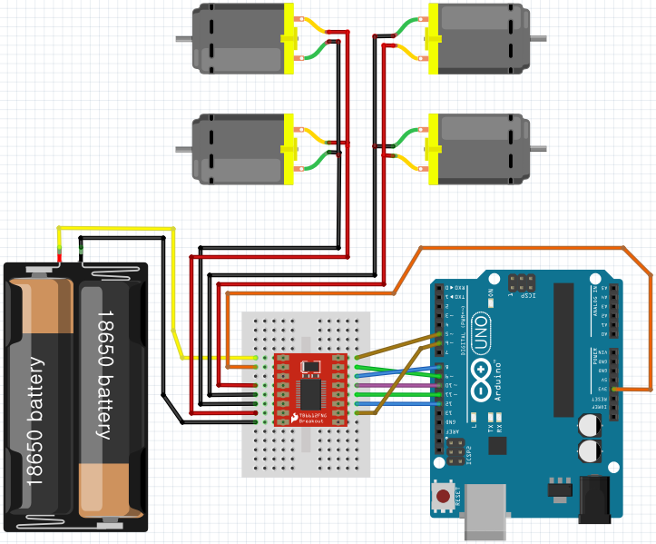

### DC모터 사용하기

아두이노의 경우와 마찬가지로 ESP32에서도 TB6612FNG 모터드라이버와 함께, 모터 및 아두이노 단독사용을 위하여 3.7V 18650 2개를 직렬로 연결한 외부전원을 사용한다.

 

#### TB6612FNG

| VM VCC GND(*) AOUT1 AOUT2 BOUT2 BOUT1 GND |                             | PWMA AIN2 AIN1 STBY BIN1 BIN2 PWMB GND |
| :----------------------------------------------------------: | :-------------------------------------------------------: | :----------------------------------------------------------: |
|                                                              |  |                                                              |

* VM (모터 전압) = 15V max
* VCC (로직 전압) = 2.7 ~ 5.5V
* **GND**
  * TB6612fng 모듈을 여러개 테스트한 결과, **3번핀 GND**에 연결할 경우 **작동이 안되는** 몇몇 제품이 있었음
  * 그러므로 **8번핀, 9번핀의 GND 사용을 권장**함
* 출력전류: 정전류 1.2A (3.2A peak)까지 (모터 2개 사용시 합산 전류임)
* 모터 제어모드: CW, CCW, short-brake, STOP, stand-by
* 두개의 모터 출력을 개별 제어하며, **100kHz**의 PWM으로 속도 제어
* 써멀 셧다운 및 저전압 감지회로 내장

 

##### Pin의 사용

ESP32와 TB6612FNG모듈을 브레드보드를 통해 연결하기 쉽도록 핀을 구성한 Pinmap이므로, 필요에 따라 수정하여 사용할 수 있다. (아래표는 참고만)

| 핀번호 | 모터드라이브1     | ESP32 DEVKIT_C V4 모듈 사용시 | ESP-WROOM-32 모듈 사용시 | 외부전원                          | 모터 / 역할    |
| ------ | ----------------- | ----------------------------- | ------------------------ | --------------------------------- | -------------- |
| 1      | VM                |                               |                          | (+) (DC모터에 사용하는 전압 사용) |                |
| 2      | VCC               | +3.3V                         | +3.3V                    |                                   |                |
| 3      | GND (사용 비추천) |                               |                          |                                   |                |
| 4      | A_OUT1            |                               |                          |                                   | 모터A          |
| 5      | A_OUT2            |                               |                          |                                   | 모터A          |
| 6      | B_OUT2            |                               |                          |                                   | 모터B          |
| 7      | B_OUT1            |                               |                          |                                   | 모터B          |
| 8      | GND               |                               |                          | (-)                               |                |
| 9      | GND               | GND                           | GND                      |                                   |                |
| 10     | B_PWM             | 12                            | 13                       |                                   | 모터B 속도제어 |
| 11     | B_IN2             | 14                            | 12                       |                                   | 모터B 방향제어 |
| 12     | B_IN1             | 27                            | 14                       |                                   | 모터B 방향제어 |
| 13     | STBY              | 26                            | 27                       |                                   | 모터 상태신호  |
| 14     | A_IN1             | 25                            | 26                       |                                   | 모터A 방향제어 |
| 15     | A_IN2             | 33                            | 25                       |                                   | 모터A 방향제어 |
| 16     | A_PWM             | 32                            | 33                       |                                   | 모터A 속도제어 |

※ 주의: Pin Map이 다른 TB6612FNG 모듈도 있으므로, 사용하는 모듈의 pinout을 확인하여야 한다.

 

 

### 모터 1개 컨트롤하기

여기서 사용하는 DC모터는 아래의 형태를 가진 기어드모터이며, 아두이노를 사용하여 자동차를 만드는데 많이 사용되는 저렴이 모터이다.

 

#### schematic

##### ESP32와 컴퓨터를 USB선으로 연결하여 사용할 경우

 

##### ESP32와 컴퓨터의 연결없이 외부전원을 사용하여 단독으로 사용할 경우

* 18650 2S 외부전원(7.4V)을 DC컨버터 모듈에 연결

  * 입력: 8~36V
  * 출력: 1.25~32V 및 USB 5V 출력
  * 75W내 사용 권장, 전류량 최대 5A (4.5A 이내 사용 권장)

  

* 여기서는 서보모터 추가 연결을 위해서, 왼쪽 가변 저항을 사용하여 출력 전압을 5V로 세팅하여 사용

* USB 출력단자는 ESP32의 microUSB 단자에 연결

 

#### sketch

~~~C++
// TB6612FNG right side & ESP32-WROOM-32D DEVKIT_C V4 left side pin order
const int PWMA = 32;  
const int INA1 = 33;
const int INA2 = 25;
const int STBY = 26;
const int INB1 = 27;
const int INB2 = 14;
const int PWMB = 12;

/*
// TB6612FNG right side & ESP32-WROOM-32 left side pin order
const int PWMA = 33;  
const int INA1 = 25;
const int INA2 = 26;
const int STBY = 27;
const int INB1 = 14;
const int INB2 = 12;
const int PWMB = 13;
*/

const int ledPin = 2;

// PWM Channel setup
const int CH_STBY = 0;
const int CH_INA1 = 1;
const int CH_INA2 = 2;
const int CH_PWMA = 3;
const int CH_INB1 = 4;
const int CH_INB2 = 5;
const int CH_PWMB = 5;
// PWM frequency and bit resolution setup
const int pwmFrequency = 10000;  // Hz
const int bitResolution = 8;     // pwm value: 0~255

void setup() {
  // put your setup code here, to run once:
  Serial.begin(115200);
  pinMode(ledPin, OUTPUT); 
    
  // tb6612fng setting
  pinMode(INA1, OUTPUT);
  pinMode(INA2, OUTPUT);
  pinMode(PWMA, OUTPUT);
  pinMode(STBY, OUTPUT);
  pinMode(INB1, OUTPUT);
  pinMode(INB2, OUTPUT);
  pinMode(PWMB, OUTPUT);
    
/*    
  // digital output initial test
  digitalWrite(INA1, HIGH);
  digitalWrite(INA2, LOW);
  digitalWrite(PWMA, LOW);
  digitalWrite(STBY, HIGH);
  digitalWrite(INB1, HIGH);
  digitalWrite(INB2, LOW);
  digitalWrite(PWMB, LOW);
  delay(1000);
*/
    
  // motor output(PWM) setting (channel, frequency, bit)
  ledcSetup(0, pwmFrequency, bitResolution);
  ledcSetup(1, pwmFrequency, bitResolution);
  ledcSetup(2, pwmFrequency, bitResolution);
  ledcSetup(3, pwmFrequency, bitResolution);
  ledcSetup(4, pwmFrequency, bitResolution);
  ledcSetup(5, pwmFrequency, bitResolution);
  ledcSetup(6, pwmFrequency, bitResolution);
  // channel setting (GPOI pin, channel)
  //                                Channel  CW  CCW Stanby Stop Brake1 Brake2 Brake3
  ledcAttachPin(STBY, CH_STBY);  // STBY (0) 255 255 0      255  255    255    255
  ledcAttachPin(INA1, CH_INA1);  // INA1 (1) 255 0   *      0    255    0      255
  ledcAttachPin(INA2, CH_INA2);  // INA2 (2) 0   255 *      0    255    255    0
  ledcAttachPin(PWMA, CH_PWMA);  // PWMA (3) PWM PWM *      255  *      0      0
  ledcAttachPin(INB1, CH_INB1);  //
  ledcAttachPin(INB2, CH_INB2);  // if STBY(CH0) = 0, Standby states.
  ledcAttachPin(PWMB, CH_PWMB);  // if STBY(CH0) = 255, and INA1&INA2 have different value 
}                          // and PWMA has some value, CW or CCW rotation is made. 

void loop() {
  /*
  // LED
  digitalWrite(ledPin, LOW);
  delay(500);
  digitalWrite(ledPin, HIGH);
  delay(500);
  digitalWrite(ledPin, LOW);
  */
  
  ledcWrite(CH_STBY, 255); //STBY
  // Motor A : CW
  ledcWrite(CH_INA1, 255); //INA1
  ledcWrite(CH_INA2, 0);   //INA2
  ledcWrite(CH_PWMA, 255); //PWMA
  delay(3000);

  /*
  // Motor B : CW
  ledcWrite(CH_INB1, 255); //INB1
  ledcWrite(CH_INB2, 0);   //INB2
  ledcWrite(CH_PWMB, 255); //PWMB
  */

  // Motor Standby
  ledcWrite(CH_STBY, 0);   //STBY
  delay(500);

  /*
  digitalWrite(ledPin, LOW);
  delay(500);
  digitalWrite(ledPin, HIGH);
  delay(500);
  digitalWrite(ledPin, LOW);
  */
  
  ledcWrite(CH_STBY, 255); //STBY
  // Motor A : CCW
  ledcWrite(CH_INA1, 0);   //INA1
  ledcWrite(CH_INA2, 255); //INA2
  ledcWrite(CH_PWMA, 255); //PWMA

  /*
  // Motor B : CCW
  ledcWrite(CH_INB1, 0);   //INB1
  ledcWrite(CH_INB2, 255); //INB2
  ledcWrite(CH_PWMB, 255); //PWMB
  delay(3000);
  */
  
  // Motor Standby
  ledcWrite(CH_STBY, 0);   //STBY
  delay(500);
}
~~~

 

~~~
int PWMA = 13;
int INA1 = 12;
int INA2 = 14;
int STBY = 27;
int INB1 = 25;
int INB2 = 26;
int PWMB = 33;
const int ledPin = 2;

void setup() {
  // put your setup code here, to run once:
  Serial.begin(115200);

  pinMode(ledPin, OUTPUT); //設定腳位為輸出
  pinMode(INA1,OUTPUT);
  pinMode(INA2,OUTPUT);
  pinMode(PWMA,OUTPUT);
  pinMode(STBY,OUTPUT);
  pinMode(INB1,OUTPUT);
  pinMode(INB2,OUTPUT);
  pinMode(PWMB,OUTPUT);
  //digital output test
  digitalWrite(INA1,HIGH); //設定腳位HIGH LOW
  digitalWrite(INA2,LOW);
  digitalWrite(PWMA,LOW);
  digitalWrite(STBY,HIGH);
  digitalWrite(INB1,HIGH);
  digitalWrite(INB2,LOW);
  digitalWrite(PWMB,LOW);
  delay(1000);
  
  //analog output(PWM) test 設定LED Channel PWM 頻率
  ledcSetup(0, 10000, 8);
  ledcSetup(1, 10000, 8);
  ledcSetup(2, 10000, 8);
  ledcSetup(3, 10000, 8);
  ledcSetup(4, 10000, 8);
  ledcSetup(5, 10000, 8);
  ledcSetup(6, 10000, 8);
  //設定腳位Channel
  ledcAttachPin(INA1, 0);
  ledcAttachPin(INA2, 1);
  ledcAttachPin(PWMA, 2);
  ledcAttachPin(STBY, 3);
  ledcAttachPin(INB1, 4);
  ledcAttachPin(INB2, 5);
  ledcAttachPin(PWMB, 6);
}

void loop() {
  // 開始前先閃動ESP32板子上LED
  //digitalWrite(ledPin,LOW);
  //delay(500);
  //digitalWrite(ledPin,HIGH);
  //delay(500);
  //digitalWrite(ledPin,LOW);
  //設定馬達1為正轉
  ledcWrite(0, 255); //INA1
  ledcWrite(1, 0);   //INA2
  ledcWrite(2, 255); //PWMA
  ledcWrite(3, 255); //STBY
  //設定馬達2為正轉
  ledcWrite(4, 255); //INB1
  ledcWrite(5, 0); //INB2
  ledcWrite(6, 255); //PWMB
  delay(3000);
  
  digitalWrite(ledPin,LOW);
  delay(500);
  digitalWrite(ledPin,HIGH);
  delay(500);
  digitalWrite(ledPin,LOW);
  //設定馬達1為反轉
  ledcWrite(0, 0);   //INA1
  ledcWrite(1, 255); //INA2
  ledcWrite(2, 255); //PWMA
  ledcWrite(3, 255); //STBY
  //設定馬達2為反轉
  ledcWrite(4, 0);   //INB1
  ledcWrite(5, 255); //INB2
  ledcWrite(6, 255); //PWMB
  delay(3000);
}
~~~

 

##### 회전 방향이 (생각했던 방향과) 반대로 회전하는 경우

A_IN1핀과 A_IN2 핀의 번호를 바꿔준다. 즉, 위 스케치에서

~~~C++
int A_IN1 = 8;
int A_IN2 = 9;
~~~

부분을

~~~C++
int A_IN1 = 9;
int A_IN2 = 8;
~~~

로 바꿔준다.

 

### 4WD 자동차 만들기

#### schematic

##### UNO보드와 컴퓨터를 USB선으로 연결하여 사용할 경우

 

##### UNO보드와 컴퓨터의 연결없이 Vin핀을 사용하여 단독으로 사용할 경우

* UNO 보드의 Vin에 외부전원(7.4V) (+)에 연결: 6.6V~12V 범위의 전원 연결 가능 (7.2V 이상 추천)
* UNO 보드의 GND를 TB6612fng 모듈의 GND에 연결

 

#### sketch

~~~ C++
// front wheel : B1 - A1
// rear  wheel : B2 - A2 

int STBY = 10;            // Standby

// Motor A 1 & 2(Right)
int A_PWM = 5;             // Speed Control
int A_IN1 = 8;
int A_IN2 = 9;

// Motor B 1 & 2(Left)
int B_PWM = 6;             // Speed Control
int B_IN1 = 11;
int B_IN2 = 12;

void setup() {
  pinMode(STBY, OUTPUT);
  pinMode(A_PWM, OUTPUT);
  pinMode(A_IN1, OUTPUT);
  pinMode(A_IN2, OUTPUT);
  pinMode(B_PWM, OUTPUT);
  pinMode(B_IN1, OUTPUT);
  pinMode(B_IN2, OUTPUT);
}

void loop() {
  move(1, 128, 0);                  // motor A(right wheels), half speed, moving forward
  move(2, 128, 0);                  // motor B(left wheels), half speed, moving forward

  delay(1000);                      // go for 1 second
  stop();                           // stop
  delay(250);                       // hold for 250ms until move again

  move(1, 128, 1);                  // motor A(right wheels), half speed, moving backward
  move(2, 128, 1);                  // motor B(left wheels), half speed, moving backward

  delay(1000);
  stop();
  delay(250);
}

void move(int motor, int speed, int direction) {   //Move specific motor at speed and direction
//motor: A(Right) -> 1, B(Left) -> 2
//speed: 0 is off, and 255 is full speed
//direction: 0 clockwise, 1 counter-clockwise

  digitalWrite(STBY, HIGH);        // Disable Standby

  boolean inPin1 = LOW;            // Defalut(direction=0) - Clockwise
  boolean inPin2 = HIGH;

  if(direction == 1) {             // Count-clockwise
    inPin1 = HIGH;
    inPin2 = LOW;
  }

  if(motor == 1){                  // if motor == 1, right wheel
    digitalWrite(A_IN1, inPin1);
    digitalWrite(A_IN2, inPin2);
    analogWrite(A_PWM, speed);
  } else {                         // if motor is not 1, left wheel
    digitalWrite(B_IN1, inPin1);
    digitalWrite(B_IN2, inPin2);
    analogWrite(B_PWM, speed);
  }
}

void stop() {
  digitalWrite(STBY, LOW);        // Enable Standby
}
~~~

 

 

### IR 리모컨으로 4WD 컨트롤하기

IR리모컨을 사용하여 RC카를 컨트롤 하기 위해서는 모터와 회로에서 발생하는 노이즈를 제거하기 위한 104 케패시터(0.1uF)를 사용하는 것이 원칙입니다. 반드시 사용해야 하는 것은 아니지만, 회로보호를 위해 캐패시터가 있는 경우에는 IR 수신부의 (+)와 (-)에 병렬연결하세요. 이에 더하여 후진시 방향전환도 가능하도록 수정해 봅니다.

 

#### schematic

##### UNO보드와 컴퓨터를 USB선으로 연결하여 사용할 경우

 

##### UNO보드와 컴퓨터의 연결없이 Vin핀을 사용하여 단독으로 사용할 경우

 

 

#### IRremote 라이브러리 추가하기

~~~ C
#include <boarddefs.h>
#include <IRremote.h>
#include <IRremoteInt.h>
#include <ir_Lego_PF_BitStreamEncoder.h>
~~~

 

#### 사용할 리모컨 버튼 HEX값 

| Remote Button     | unsigned int data | define |
| ----------------- | ----------------- | ------ |
| ▲ (전진 / 속도 증가)    | 0XFF18E7          | BTN_U  |
| ▼ (후진 / 속도 감소)    | 0XFFA4B5          | BTN_D  |
| ◀ (좌회전 / 좌회전각 증가) | 0XFF10EF          | BTN_L  |
| ▶ (우회전 / 우회전각 증가) | 0XFF5AA5          | BTN_R  |
| OK (정지)           | 0XFF38C7          | BTN_O  |

보유하고 있는 리모컨의 종류마다 HEX값이 다르므로, HEX값은 다를 수 있습니다. HEX값을 알아내는 방법은 IR Remote를 다루는 페이지를 참고하세요.

 

#### sketch

~~~ C++
//Initialize IR remote
#include <boarddefs.h>
#include <IRremote.h>
#include <IRremoteInt.h>
#include <ir_Lego_PF_BitStreamEncoder.h>

int RECV_PIN = 13;              // IR Signal pin
IRrecv irrecv(RECV_PIN);
decode_results results;

#define BTN_F 0xFF18E7  // Forward Button
#define BTN_B 0xFF4AB5  // Backward Button
#define BTN_L 0xFF10EF  // Left Button
#define BTN_R 0xFF5AA5  // Right Button
#define BTN_O 0xFF38C7  // OK Button

// Initialize TB6612FNG Motor drive
int STBY = 10;  // STBY pin on TB6612FNG. Must be HIGH to enable motor
int A_PWM = 5;  // Right motor speed control using analogWrite() function. Value between 0 - 255
int A_IN1 = 9;  // Right motor - LOW should go forward
int A_IN2 = 8;  // Right motor - HIGH should go forward
int B_PWM = 6;  // Left motor speed control using analogWrite() function. Value between 0 - 255
int B_IN1 = 11; // Left motor - LOW should go forward
int B_IN2 = 12; // Left motor - HIGH should go forward

int R_MaxSpeed = 255;   //set motor speed to max speed
int L_MaxSpeed = 255;   //set motor speed to max speed
int R_TurnSpeed = 128;  //set motor speed to max speed
int L_TurnSpeed = 128;  //set motor speed to max speed

int LR_Direct = 0;      //for Direction

void setup() {
  pinMode(A_PWM, OUTPUT);
  pinMode(A_IN1, OUTPUT);
  pinMode(A_IN2, OUTPUT);
  pinMode(B_PWM, OUTPUT);
  pinMode(B_IN1, OUTPUT);
  pinMode(B_IN2, OUTPUT);
  pinMode(STBY, OUTPUT);
  
  Serial.begin(9600);
  irrecv.enableIRIn();                           // Start the receiver
}

void loop() {
  if (irrecv.decode(&results)) {                 // Read IR remote control
    //Serial.println(results.value, HEX);        // for debug
    irrecv.resume();                             // Receive the next value
  }
  
  switch(results.value) {
    
    case BTN_F:
      go_forward();
      break;
      
    case BTN_B:  
      go_backward();
      break;
      
    case BTN_L:  
      if(LR_Direct==0) {
        go_f_left();
      } else if(LR_Direct==1) {
        go_b_left();
      }     
      break;
      
    case BTN_R:
      if(LR_Direct==0) {
        go_f_right();
      } else if(LR_Direct==1) {
        go_b_right();
      }
      break;
      
    case BTN_O:
      stop();
      break;
  }  
  delay(50);
}

// Move specific motor at speed and direction
// motor: A(Right) -> 0, B(Left) -> 1
// speed: 0 is off, and 255 is full speed
// direction: 0 clockwise, 1 counter-clockwise

void move(int motorLR, int speed, boolean inPin1, boolean inPin2) {
  digitalWrite(STBY, HIGH);        // Disable Standby
  
  if (motorLR == 0) {
    analogWrite(A_PWM, speed);
    digitalWrite(A_IN1, inPin1);
    digitalWrite(A_IN2, inPin2);   
  }
  
  if (motorLR == 1) {
    analogWrite(B_PWM, speed);
    digitalWrite(B_IN1, inPin1);
    digitalWrite(B_IN2, inPin2);
  }
}

void go_forward() {
  Serial.println("F");
  move(0, R_MaxSpeed, 0, 1);  // Right motor, Right Speed, forward(0,1)
  move(1, L_MaxSpeed, 0, 1);  // Left motor, Left Speed, forward(0,1)
  LR_Direct = 0;              // Forward
  delay(100);
}

void go_backward() {
  Serial.println("B");
  move(0, R_MaxSpeed, 1, 0);  // Right motor, Right Speed, backward(1,0)
  move(1, L_MaxSpeed, 1, 0);  // Left motor, Left Speed, backward(1,0)
  LR_Direct = 1;              // Backward
  delay(100);
}

void go_f_left() {
  Serial.println("F_L");
  move(0, R_MaxSpeed, 0, 1);  // Right motor, Right Speed, forward(0,1)
  move(1, L_TurnSpeed, 0, 1); // Left motor, Left Speed, forward(0,1)
  delay(100);
}

void go_b_left() {
  Serial.println("F_R");
  move(0, R_MaxSpeed, 1, 0);  // Right motor, Right Speed, backward(1,0)
  move(1, L_TurnSpeed, 1, 0); // Left motor, Left Speed, backward(1,0)

  delay(100);
}

void go_f_right() {
  Serial.println("F_R");
  move(0, R_TurnSpeed, 0, 1); // Right motor, Right Speed, forward(0,1)
  move(1, L_MaxSpeed, 0, 1);  // Left motor, Left Speed, forward(0,1)
  delay(100);
}

void go_b_right() {
  Serial.println("B_R");
  move(0, R_TurnSpeed, 1, 0); // Right motor, Right Speed, backward(1,0)
  move(1, L_MaxSpeed, 1, 0);  // Left motor, Left Speed, backward(1,0)

  delay(100);
}

void stop() {
  Serial.println("STOP");
  digitalWrite(STBY, LOW);    // Enable Standby
}
~~~

 

 

### 초음파 센서 장착

초음파 센서를 장착하여 전진시 일정한 거리 내에  장애물이 있으면 자동차를 멈춰보도록 하겠습니다. Trig는 아두이노 2번핀, Echo는 4번핀에 연결하였습니다.

 

#### schematic

##### UNO보드와 컴퓨터를 USB선으로 연결하여 사용할 경우

 

##### UNO보드와 컴퓨터의 연결없이 Vin핀을 사용하여 단독으로 사용할 경우

 

#### sketch

~~~ C++
//Initialize IR remote
#include <boarddefs.h>
#include <IRremote.h>
#include <IRremoteInt.h>
#include <ir_Lego_PF_BitStreamEncoder.h>

int RECV_PIN = 13;       // IR Signal pin
IRrecv irrecv(RECV_PIN);
decode_results results;

#define BTN_F 0xFF18E7  // Forward Button
#define BTN_B 0xFF4AB5  // Backward Button
#define BTN_L 0xFF10EF  // Left Button
#define BTN_R 0xFF5AA5  // Right Button
#define BTN_O 0xFF38C7  // OK Button

// Initialize TB6612FNG Motor drive
int STBY = 10;  // STBY pin on TB6612FNG. Must be HIGH to enable motor
int A_PWM = 5;  // Right motor speed control using analogWrite() function. Value between 0 - 255
int A_IN1 = 9;  // Right motor - LOW should go forward
int A_IN2 = 8;  // Right motor - HIGH should go forward
int B_PWM = 6;  // Left motor speed control using analogWrite() function. Value between 0 - 255
int B_IN1 = 11; // Left motor - LOW should go forward
int B_IN2 = 12; // Left motor - HIGH should go forward

int R_MaxSpeed = 255;   //set motor speed to max speed
int L_MaxSpeed = 255;   //set motor speed to max speed
int R_TurnSpeed = 128;  //set motor speed to max speed
int L_TurnSpeed = 128;  //set motor speed to max speed

int LR_Direct = 0;      //for Direction

// Initialize Ultrasonic Sensor
#define TRIG 2
#define ECHO 4

void setup() {
  pinMode(A_PWM, OUTPUT);                        // Motor
  pinMode(A_IN1, OUTPUT);
  pinMode(A_IN2, OUTPUT);
  pinMode(B_PWM, OUTPUT);
  pinMode(B_IN1, OUTPUT);
  pinMode(B_IN2, OUTPUT);
  pinMode(STBY, OUTPUT);
  
  pinMode(TRIG, OUTPUT);                         // Ultrasonic Sensor
  pinMode(ECHO, INPUT);

  Serial.begin(9600);
  irrecv.enableIRIn();                           // Start the receiver
}

void loop() {
  digitalWrite(TRIG, LOW);                       // Start Ultrasonic sensor
  delayMicroseconds(2);
  digitalWrite(TRIG, HIGH);
  delayMicroseconds(10);
  digitalWrite(TRIG, LOW);

  long distance = pulseIn(ECHO, HIGH) / 58.2;    // 거리 측정

  if (irrecv.decode(&results)) {                 // Read IR remote control
    //Serial.println(results.value, HEX);        // for debug
    irrecv.resume(); // Receive the next value
  }

  if (distance < 10) {                            // 거리가 10cm 이내이면 정지
    stop();
    delay(500);
  }
  else {                                          // 거리가 10cm 이상이면,
  	switch(results.value) {
    
    case BTN_F:
      go_forward();
      break;
      
    case BTN_B:  
      go_backward();
      break;
      
    case BTN_L:  
      if(LR_Direct==0) {
        go_f_left();
      } else if(LR_Direct==1) {
        go_b_left();
      }     
      break;
      
    case BTN_R:
      if(LR_Direct==0) {
        go_f_right();
      } else if(LR_Direct==1) {
        go_b_right();
      }
      break;
      
    case BTN_O:
      stop();
      break;
  }  
  delay(50);
}

// Move specific motor at speed and direction
// motor: A(Right) -> 0, B(Left) -> 1
// speed: 0 is off, and 255 is full speed
// direction: 0 clockwise, 1 counter-clockwise

void move(int motorLR, int speed, boolean inPin1, boolean inPin2) {
  digitalWrite(STBY, HIGH);        // Disable Standby

  if (motorLR == 0) {
    analogWrite(A_PWM, speed);
    digitalWrite(A_IN1, inPin1);
    digitalWrite(A_IN2, inPin2);   
  }

  if (motorLR == 1) {
    analogWrite(B_PWM, speed);
    digitalWrite(B_IN1, inPin1);
    digitalWrite(B_IN2, inPin2);
  }
}

void go_forward() {
  Serial.println("F");
  move(0, R_MaxSpeed, 0, 1);  // Right motor, Right Speed, forward(0,1)
  move(1, L_MaxSpeed, 0, 1);  // Left motor, Left Speed, forward(0,1)
  LR_Direct = 0;              // Forward
  delay(100);
}

void go_backward() {
  Serial.println("B");
  move(0, R_MaxSpeed, 1, 0);  // Right motor, Right Speed, backward(1,0)
  move(1, L_MaxSpeed, 1, 0);  // Left motor, Left Speed, backward(1,0)

  LR_Direct = 1;              // Backward
  delay(100);
}

void go_f_left() {
  Serial.println("F_L");
  move(0, R_MaxSpeed, 0, 1);  // Right motor, Right Speed, forward(0,1)
  move(1, L_TurnSpeed, 0, 1); // Left motor, Left Speed, forward(0,1)
  delay(100);
}

void go_b_left() {
  Serial.println("F_R");
  move(0, R_MaxSpeed, 1, 0);  // Right motor, Right Speed, backward(1,0)
  move(1, L_TurnSpeed, 1, 0); // Left motor, Left Speed, backward(1,0)
  delay(100);
}

void go_f_right() {
  Serial.println("F_R");
  move(0, R_TurnSpeed, 0, 1); // Right motor, Right Speed, forward(0,1)
  move(1, L_MaxSpeed, 0, 1);  // Left motor, Left Speed, forward(0,1)
  delay(100);
}

void go_b_right() {
  Serial.println("B_R");
  move(0, R_TurnSpeed, 1, 0); // Right motor, Right Speed, backward(1,0)
  move(1, L_MaxSpeed, 1, 0);  // Left motor, Left Speed, backward(1,0)
  delay(100);
}

void stop() {
  Serial.println("STOP");
  digitalWrite(STBY, LOW);    // Enable Standby
}
~~~

