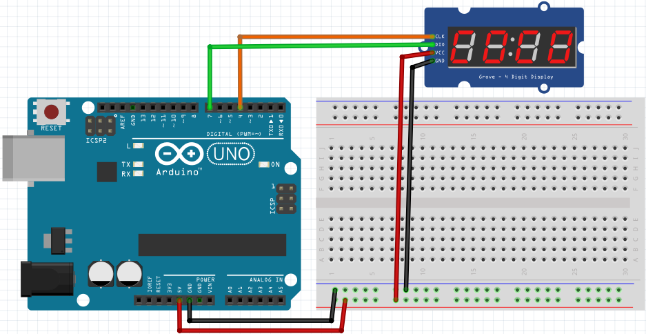
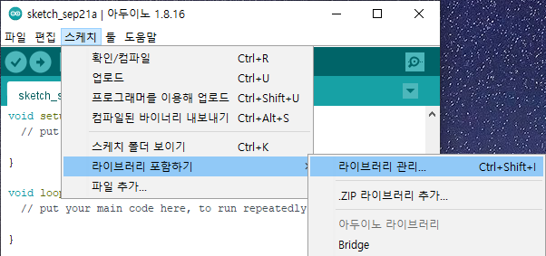
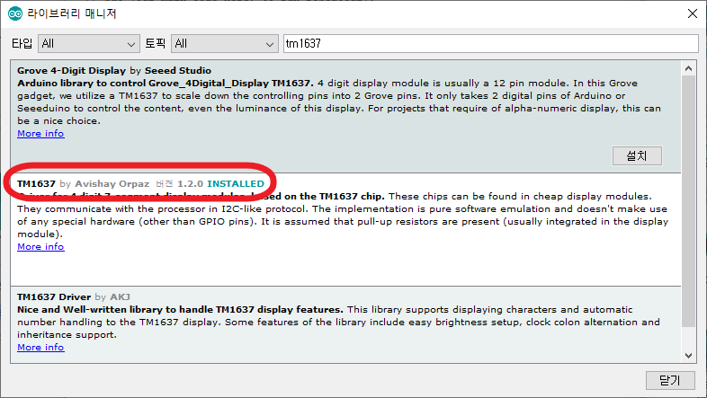

### TM1637

<br>

#### schematic



| TM1637  | CLK  | DIO  | VCC  | GND  |
| ------- | ---- | ---- | ---- | ---- |
| Arduino | 4    | 7    | 5V   | GND  |

<br>

#### 라이브러리 추가하기

1. 파일> 새파일>
2. **스케치**\> **라이브러리 포함하기**\> **라이브러리 관리**>



<br>

3. 라이브러리 매니저 창이 뜨면, 검색란에 “tm1637"를 적어 넣음. tm1637관련 라이브러리가 5~6개정도 검색됨. TM1637 by Avishay Orpaz 라이브러리를 선택하여 설치



<br><br>

### TM1637 숫자 표기 방법


    for TM1637 by Avishay Orpaz library 
       *  A  *
       F     B
       *  G  *
       E     C
       *  D  *  DP

<br>

#### sketch

"8.8.8.8." → " " → "0123" → "dOnE"

```C
#include <Arduino.h>
#include <TM1637Display.h>

// Module connection pins (Digital Pins)
#define CLK 4
#define DIO 7

// The amount of time (in milliseconds) between tests
#define TEST_DELAY   2000

const uint8_t SEG_DONE[] = {
  SEG_B | SEG_C | SEG_D | SEG_E | SEG_G,               // d
  SEG_A | SEG_B | SEG_C | SEG_D | SEG_E | SEG_F,       // O
  SEG_C | SEG_E | SEG_G,                               // n
  SEG_A | SEG_D | SEG_E | SEG_F | SEG_G                // E
  };

TM1637Display display(CLK, DIO);

void setup()
{
}

void loop()
{
  uint8_t data[] = { 0xff, 0xff, 0xff, 0xff };
  uint8_t blank[] = { 0x00, 0x00, 0x00, 0x00 };

  display.setBrightness(15); // 0 ~ 15 (15가 가장 밝음)
  // display.setBrightness(0x0f);

  // All segments on
  display.setSegments(data);            // "8.8.8.8."   
  delay(TEST_DELAY);

  // Selectively set different digits   // "0123"
  data[0] = display.encodeDigit(0);
  data[1] = display.encodeDigit(1);
  data[2] = display.encodeDigit(2);
  data[3] = display.encodeDigit(3);
  display.setSegments(data);
  delay(TEST_DELAY);

  // Done!
  display.setSegments(SEG_DONE);        // "dOnE"
  delay(TEST_DELAY);
}
```

<br>

<br>


### 0000~9999까지 나타내기

<br>

#### for() 문을 이용하는 방법
먼저 가장 간단하게 for문을 사용하여 0~9999까지의 숫자를 표시해보겠습니다.

```C
#include <Arduino.h>
#include <TM1637Display.h>

// Module connection pins (Digital Pins)
#define CLK 4
#define DIO 7

uint8_t data[] = { 0x00, 0x00, 0x00, 0x00 };  // 초기 출력값 0000 
int seg3, seg2, seg1, seg0;

TM1637Display display(CLK, DIO);

void setup() {
  display.setBrightness(15);                  // 0 ~ 15 (15가 가장 밝음)
  // display.setBrightness(0x0f);

  Serial.begin(9600); 
}

void loop() {
  for(int digitValue = 0; digitValue <= 9999; digitValue++) {     // 0~9999까지 1씩 증가시킴
    seg0 = (digitValue / 1000) % 10; // 4자리에서 1000의 자리 숫자 저장
    seg1 = (digitValue / 100) % 10;  // 4자리에서 100의 자리 숫자 저장
    seg2 = (digitValue / 10) % 10;   // 4자리에서 10의 자리 숫자 저장
    seg3 = digitValue % 10;          // 4자리에서 1의 자리 숫자 저장

    data[0]=display.encodeDigit(seg0);  // 첫번째 FND에 1000의 자리 숫자배열
    data[1]=display.encodeDigit(seg1);  // 두번째 FND에 100의 자리 숫자 배열
    data[2]=display.encodeDigit(seg2);  // 세번째 FND에 10의 자리 숫자 배열
    data[3]=display.encodeDigit(seg3);  // 네번째 FND에 1의 자리 숫자 배열

    display.setSegments(data);
    Serial.println(digitValue);
    delay(10);                       // 10ms 마다 카운트
  }
}
```

<br>

<br>


#### millis() 함수를 이용하는 방법
millis() 함수를 이용하여 시간카운트를 통해 0~9999까지 카운트 해보는 방법도 있습니다.

**※ 주의: seg0, seg1, seg2, seg3 등의 변수값이 10~15사이의 값을 갖게되면 16진수(A~F)로 표현되므로, 각 변수는 10보다 작은 값을 갖도록 해야한다.**

```C
extern volatile unsigned long timer0_millis;   // millis() 리셋을 위한 변수

#include <Arduino.h>
#include <TM1637Display.h>

// Module connection pins (Digital Pins)
#define CLK 4
#define DIO 7

unsigned long previousTime, currentTime;      // 현재시간, 현재시간(ms)
int timeValue;
uint8_t data[] = { 0x00, 0x00, 0x00, 0x00 };  // 초기 출력값 0000 
int seg3, seg2, seg1, seg0;

TM1637Display display(CLK, DIO);

void setup() {
  display.setBrightness(15);                  // 0 ~ 15 (15가 가장 밝음)
  // display.setBrightness(0x0f);

  Serial.begin(9600); 
}

void loop() {
  currentTime = millis();                    // 현재 시간값을 측정
  
/*
  if(currentTime - previousTime >= 1000) {   // 현재 시간값을 1s마다 1000씩 증가시킴
    previousTime = currentTime;
    timeValue = currentTime / 1000;          // 1s 마다 1000씩 증가된 숫자를 1000으로 나누어 줌.
                                             // (결과적으로 1s마다 1씩 증가된 숫자가 timeValue에 저장됨)
*/
  if(currentTime - previousTime >= 100) {    // 현재 시간값을 0.1s마다 100씩 증가시킴
    previousTime = currentTime;
    timeValue = currentTime / 100;           // 0.1s 마다 100씩 증가된 숫자를 100으로 나누어 줌.
                                             // (결과적으로 0.1s마다 1씩 증가된 숫자가 timeValue에 저장됨)
/*
  if(currentTime - previousTime >= 10) {     // 현재 시간값을 0.01s마다 10씩 증가시킴
    previousTime = currentTime;
    timeValue = currentTime / 10;            // 0.01s 마다 10씩 증가된 숫자를 10으로 나누어 줌.
                                                (결과적으로 0.01s마다 1씩 증가된 숫자가 timeValue에 저장됨)  
*/  
    seg0 = (timeValue / 1000) % 10;          // 현재 시간값 4자리에서 1000의 자리 숫자 저장
    seg1 = (timeValue / 100) % 10;           // 현재 시간값 4자리에서 100의 자리 숫자 저장
    seg2 = (timeValue / 10) % 10;            // 현재 시간값 4자리에서 10의 자리 숫자 저장
	seg3 = timeValue % 10;                   // 현재 시간값 4자리에서 1의 자리 숫자 저장

    data[0]=display.encodeDigit(seg0);       // 첫번째 Segment에 1000의 자리 숫자 배열
    data[1]=display.encodeDigit(seg1);       // 두번째 Segment에 100의 자리 숫자 배열
    data[2]=display.encodeDigit(seg2);       // 세번째 Segment에 10의 자리 숫자 배열
    data[3]=display.encodeDigit(seg3);       // 네번째 Segment에 1의 자리 숫자 배열

    display.setSegments(data);
    Serial.println(timeValue);
  }

  if(currentTime>=1000000) {                  // 1,000,000ms(1000초) 후 millis() 리셋
    timer0_millis = 0;
    previousTime = 0;
  }
}
```

<br>

<br>

### millis() 함수를 이용하여 (분:초) 시계 만들기

**※ 주의: seg0, seg1, seg2, seg3 등의 변수값이 10~15사이의 값을 갖게되면 16진수(A~F)로 표현되므로, 각 변수는 10보다 작은 값을 갖도록 해야한다.**

~~~C
extern volatile unsigned long timer0_millis;   // millis() 리셋을 위한 변수

#include <Arduino.h>
#include <TM1637Display.h>

// Module connection pins (Digital Pins)
#define CLK 4
#define DIO 7

unsigned long previousTime, currentTime;      // 현재시간, 현재시간(ms)
int timeValue;
uint8_t data[] = { 0x00, 0x00, 0x00, 0x00 };  // 초기 출력값 0000
uint8_t segto;
int seg3, seg2, seg1, seg0;
int initTime = 5948;                          // 초기 시간 59분 48초

TM1637Display display(CLK, DIO);

void setup() {
  display.setBrightness(7);                   // 0 ~ 15 (15가 가장 밝음)
  // display.setBrightness(0x0f);

  seg0 = (initTime / 1000) % 10;              // 초기 시간값 4자리에서 1000의 자리 숫자 저장
  seg1 = (initTime / 100) % 10;               // 초기 시간값 4자리에서 100의 자리 숫자 저장
  seg2 = (initTime / 10) % 10;                // 초기 시간값 4자리에서 10의 자리 숫자 저장
  seg3 = initTime % 10;                       // 초기 시간값 4자리에서 1의 자리 숫자 저장

  Serial.begin(9600); 
}

void loop() {
  currentTime = millis();                     // 현재 시간값을 측정
  
  if(currentTime - previousTime >= 1000) {    // 현재 시간값을 0.1s마다 100씩 증가시킴
    previousTime = currentTime;
    timeValue = currentTime / 1000;           // 0.1s 마다 100씩 증가된 숫자를 100으로 나누어 줌.
                                              // (결과적으로 0.1s마다 1씩 증가된 숫자가 timeValue에 저장됨)  
    seg3++;
    if(seg3 == 10) {
      seg3 = 0;
      seg2++;
    }
    if(seg2 == 6 && seg3 == 0) {
      seg2 = 0;
      seg1++;
    }
    if(seg1 == 10) {
      seg1 = 0;
      seg0++;
    }
    if(seg0 == 6 && seg1 == 0) {
      seg0 = 0;
      seg1 = 0;
      seg2 = 0;
      seg3 = 0;
    }

    data[0]=display.encodeDigit(seg0);         // 첫번째 Segment에 1000의 자리 숫자 배열
    data[1]=display.encodeDigit(seg1);         // 두번째 Segment에 100의 자리 숫자 배열
    data[2]=display.encodeDigit(seg2);         // 세번째 Segment에 10의 자리 숫자 배열
    data[3]=display.encodeDigit(seg3);         // 네번째 Segment에 1의 자리 숫자 배열

    // 0.5초마다 콜론 깜박이기
    segto = 0x80 | display.encodeDigit(seg1);  // 분과 초사이의 콜론(:) 표시
    display.setSegments(&segto,1,1);
    delay(500);                                // 깜박임 딜레이
    display.setSegments(data);
    delay(500);                                // 깜박임 딜레이
  }

  if(currentTime>=86400000) {                  // 86,400,000ms(86,400초 = 24시간*60분/시간*60분/초) 후 millis() 리셋
    timer0_millis = 0;
    previousTime = 0;
  }
}
~~~

<br>

<br>

### 다양한 표현방법 익히기

```C
#include <Arduino.h>
#include <TM1637Display.h>

// Module connection pins (Digital Pins)
#define CLK 4
#define DIO 7

// The amount of time (in milliseconds) between tests
#define TEST_DELAY   2000

const uint8_t SEG_DONE[] = {
  SEG_B | SEG_C | SEG_D | SEG_E | SEG_G,               // d
  SEG_A | SEG_B | SEG_C | SEG_D | SEG_E | SEG_F,      // O
  SEG_C | SEG_E | SEG_G,                                // n
  SEG_A | SEG_D | SEG_E | SEG_F | SEG_G                // E
  };

TM1637Display display(CLK, DIO);

void setup()
{
}

void loop()
{
  int k;
  uint8_t data[] = { 0xff, 0xff, 0xff, 0xff };
  uint8_t blank[] = { 0x00, 0x00, 0x00, 0x00 };

  display.setBrightness(15); // 0 ~ 15 (15가 가장 밝음)
  // display.setBrightness(0x0f);

  // All segments on
  display.setSegments(data);
  delay(TEST_DELAY);

  // Selectively set different digits
  data[0] = display.encodeDigit(0);
  data[1] = display.encodeDigit(1);
  data[2] = display.encodeDigit(2);
  data[3] = display.encodeDigit(3);
  display.setSegments(data);
  delay(TEST_DELAY);

  /*
  for(k = 3; k >= 0; k--) {
  display.setSegments(data, 1, k);
  delay(TEST_DELAY);
  }
  */

  display.clear();
  display.setSegments(data+2, 2, 2);
  // __23 -> data+2: data배열 0123에서 앞에 두 자리 건너 띄운 후,
  // 2: 남은 숫자 중 2자리를 잘라서, 2: 앞의 2칸을 띄운 후 출력 
  delay(TEST_DELAY);

  display.clear();
  display.setSegments(data+2, 2, 1);
  // _23_ -> data+2: data배열 0123에서 앞에 두 자리 건너 띄운 후,
  // 2: 남은 숫자 중 2자리를 잘라서, 1: 앞의 1칸을 띄운 후 출력
  delay(TEST_DELAY);

  display.clear();
  display.setSegments(data+1, 3, 1);
  // _123 -> data+1: data배열 0123에서 앞에 한자리 건너 띄운 후,
  // 3: 남은 숫자 중 3자리를 잘라서, 1: 앞의 1칸을 띄운 후 출력
  delay(TEST_DELAY);

  display.clear();
  display.setSegments(data+3, 1, 2);
  // __3_ -> data+2: data배열 0123에서 앞에 두 자리 건너 띄운 후,
  // 1: 남은 숫자 중 1자리를 잘라서, 2: 앞의 2칸을 띄운 후 출력 
  delay(TEST_DELAY);

  display.clear();
  display.setSegments(data+3, 2, 1);
  // _3__ -> data+2: data배열 0123에서 앞에 두 자리 건너 띄운 후,
  // 2: 남은 숫자 중 2자리를 잘라서(3이 마지막 자리이므로 1자리만 자름)
  // 2: 앞의 2칸을 띄운 후 출력 
  delay(TEST_DELAY);

  // Show decimal numbers with/without leading zeros
  display.showNumberDec(0, false); // Expect: ___0
  delay(TEST_DELAY);
  display.showNumberDec(0, true);  // Expect: 0000
  delay(TEST_DELAY);
  display.showNumberDec(1, false); // Expect: ___1
  delay(TEST_DELAY);
  display.showNumberDec(1, true);  // Expect: 0001
  delay(TEST_DELAY);
  display.showNumberDec(301, false); // Expect: _301
  delay(TEST_DELAY);
  display.showNumberDec(301, true); // Expect: 0301
  delay(TEST_DELAY);
  display.clear();
  display.showNumberDec(14, false, 2, 1); // Expect: _14_
  delay(TEST_DELAY);
  display.clear();
  display.showNumberDec(4, true, 2, 2);  // Expect: __04
  delay(TEST_DELAY);
  display.showNumberDec(-1, false);  // Expect: __-1
  delay(TEST_DELAY);
  display.showNumberDec(-12);        // Expect: _-12
  delay(TEST_DELAY);
  display.showNumberDec(-999);       // Expect: -999
  delay(TEST_DELAY);
  display.clear();
  display.showNumberDec(-5, false, 3, 0); // Expect: _-5_
  delay(TEST_DELAY);
  display.showNumberHexEx(0xf1af);        // Expect: f1Af
  delay(TEST_DELAY);
  display.showNumberHexEx(0x2c);          // Expect: __2C
  delay(TEST_DELAY);
  display.showNumberHexEx(0xd1, 0, true); // Expect: 00d1
  delay(TEST_DELAY);
  display.clear();
  display.showNumberHexEx(0xd1, 0, true, 2); // Expect: d1__
  delay(TEST_DELAY);
  
  // Run through all the dots
  for(k=0; k <= 4; k++) {
    display.showNumberDecEx(0, (0x80 >> k), true);
    delay(TEST_DELAY);
  }

  display.showNumberDecEx(3141, (0x80 >> 0), true);
  // 3.141 -> 0x80: dot출력, 0x40: 콜론출력, >>0: 첫번째 도트출력,
  // true: 빈자리 0으로 채우기
     delay(TEST_DELAY);

  display.showNumberDecEx(243, (0x80 >> 1), false);
  // _2.43 -> 0x80: dot출력, 0x40: 콜론출력, >>1: 두번째 도트출력,
  // true: 빈자리 0으로 채우기
    delay(TEST_DELAY);

  display.showNumberDecEx(314, (0x80 >> 2), false);
  // _31.4 -> 0x80: dot출력, 0x40: 콜론출력, >>2: 세번째 도트출력,
  // false: 빈자리 채우지 않기
    delay(TEST_DELAY);

  display.showNumberDecEx(52, (0x80 >> 3), false);
  // __52. -> 0x80: dot출력, 0x40: 콜론출력, >>3: 네번째 도트출력,
  // false: 빈자리 채우지 않기
    delay(TEST_DELAY);

  // Brightness Test
  for(k = 0; k < 4; k++)
      data[k] = 0xff;           // 모두 segment를 키는 data배열 선언
  for(k = 0; k < 7; k++) {
    display.setBrightness(k);  // 밝기를 7단계에 걸쳐 점점 밝게 출력 
    display.setSegments(data);
    delay(TEST_DELAY);
  }
  
  // On/Off test
  for(k = 0; k < 4; k++) {
    display.setBrightness(7, false);  // Turn off
    display.setSegments(data);
    delay(TEST_DELAY);
    display.setBrightness(7, true); // Turn on
    display.setSegments(data);
    delay(TEST_DELAY);  
  }

  // Done!
  display.setSegments(SEG_DONE);

  // while(1);
}
```

