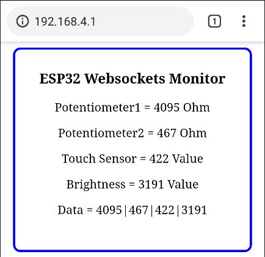

# ESP32 AP mode & Websocket

<br>

## Introduction

<br>

### AP mode

ESP32를 AP mode로 설정하여 라우터(공유기) 장치 없이 Client가 ESP32에 직접 접속하는 방법으로 데이터를 주고받는 통신을 구현해보도록 하겠습니다. 

<br>

ESP32는 기본적으로 블루투스와 wifi를 방식의 무선 통신을 지원합니다. 각각의 방식이 갖는 장단점이 있으므로 상황에 맞추어 적절한 통신 방식을 선택하면 됩니다.

| ESP32 통신모드 | 블루투스                 | wifi Station Mode              | wifi AP Mode |
| -------------- | ------------------------ | ------------------------------ | ------------ |
| 라우터         | 불필요                   | 필요                           | 불필요       |
| 통신거리       | 10m 이내 (장애물에 약함) | 일반적인 wifi 도달 거리와 동일 | 좌동         |
| 전력           | 저전력                   | 블루투스 통신에 비해 사용량 큼 | 좌동         |

<br>

학교에서 ESP32를 이용하는 경우,

- 다양한 형태의 과학 실험에 대응할 수 있어야 함
- 과학실 내부 혹은 야외에서도 이용할 수 있도록 이동이 편리해야 함
  - 기본적으로 라우터에 종속되지 않는 것이 좋음
- 디스플레이 장치는 학생이 본인의 스마트폰을 이용할 수 있어야 함
  - 별도의 OLED, LCD와 같은 디스플레이를 이용하는 경우, 실험장치의 배선이 복잡해짐
  - 단, OLED나 LCD를 활용하는 경우 흥미 유발에 도움을 줌

<br>

위 사항을 고려할 때 ESP32를 통해 여러 가지 실험을 하고 결과를 도출하는 환경의 다양성을 수용하기 위하여, AP mode가 가장 적합하다고 판단하여 이를 사용해보고자 합니다.

<br>

<br>

## AP mode 설정

참고: https://randomnerdtutorials.com/esp32-access-point-ap-web-server/

- ssid, password 설정

  - 과학실에서 모둠별로 별도의 ESP32를 이용한다면, 각 모둠에서 사용하는 ESP32를 구분할 수 있도록 ssid에 각 모둠의 번호를 적어두는 것이 좋을 것입니다. 동일한 ssid가 설정되면 다른 모둠의 데이터 값을 받을 수 있으므로, 반드시 구분짓도록 안내해야 합니다.

  ```C
  const char* ssid = "ESP32-AP-x";      // max 63 characters, x is team number
  const char* password = "123456789";   // min 8 characters 
  ```

- AP mode 실행: 위의 설정에 의해 다음의 라인을 통해 AP mode를 실행합니다.

  ```C
  WiFi.softAP(ssid, password);
  ```

- AP mode 실행 옵션: ssid, password 이외의 다양한 옵션을 추가할 경우에는 아래의 방법으로 설정하고 AP mode를 실행합니다.

  ```C
  WiFi.softAP(const char* ssid, const char* password, int channel, int ssid_hidden, int max_connection)
  ```

  - channel: Wi-Fi channel number (1-13)
  - ssid_hidden: (0 = broadcast SSID, 1 = hide SSID)
  - max_connection: maximum simultaneous connected clients (1-4)
  
- AP mode 실행시 ESP32에 부여된 IP는 다음의 방법으로 확인할 수 있습니다.

  ```C
  IPAddress IP = WiFi.softAPIP();
  Serial.print("AP IP address: ");
  Serial.println(IP);
  ```
  
  - AP mode를 사용할 경우, ESP32는 기본적으로 **192.168.4.1**의 주소를 부여 받습니다.

<br>

<br>

## Websocket 설정

참고: [Martyn Currey Blog](http://www.martyncurrey.com/esp8266-and-the-arduino-ide-part-10a-iot-website-temperature-and-humidity-monitor/)

<br>

#### 왜 웹소켓을 사용하는가?

이 문서는 학생들의 스마트폰을 클라이언트로 활용하여 과학실험을 하는 상황을 전제로,  ESP32에 웹브라우저를 통해 접속하여 실험결과 값을 모니터링하려고 합니다. 실험의 성격에 따라 웹페이지를 refresh하면서 모니터링하는 것이 좋을 수도 있고, refresh하지 않아도 결과값이 update되는 것이 더 좋을 수도 있겠지만, 여기서는 후자의 방법을 택하여 결과값을 나타내보도록 하겠습니다. 이때 필요한 기술이 웹소켓입니다.

<br>

### 웹소켓

WebSocket은 TCP 연결을 사용하여 서버와 클라이언트 사이의 지속적인 양방향 통신을 허용하는 방법입니다. 이를 통해 클라이언트에서 서버로, 서버에서 클라이언트로 데이터를 언제든지 보낼 수 있습니다.

WebSocket을 활용하기 이전에는, 일반적인 HTML 방식이나 AJAX(Asynchronous Javascript And XML)와 같은 비동기식 방법을 사용하여 센서값을 클라이언트에게 전송하는 방식을 사용했습니다. 단, 이 방법은 새로운 센서값이 발생하더라도 동시에 여러 개의 탭 (동일하거나 다른 장치에 있음)이 열려있다면 상태가 모두 업데이트되지 않는 다는 단점이 있습니다. 그렇기 때문에 웹페이지 전체를 refresh하거나 웹페이지의 일부분만이라도 새롭게 로드해야만 변경사항이 반영시켜야만 했습니다. 

이를 보완하기 위해 WebSocket 프로토콜을 사용할 수 있습니다. WebSocket은 변경 사항이 발생하면 모든 클라이언트에 알림을 보내고 그에 따라 웹 페이지를 업데이트 합니다.

클라이언트는 WebSocket 핸드 셰이크라는 프로세스를 통해 서버와 WebSocket 연결을 설정합니다. 핸드 셰이크는 HTTP request와 response로 시작하여 서버가 동일한 포트에서 WebSocket 연결뿐만 아니라 HTTP 연결을 처리 할 수 있도록 합니다. 연결이 설정되면 클라이언트와 서버는 WebSocket 데이터를 full duplex 모드로 보낼 수 있습니다. 즉, WebSockets 프로토콜을 사용하여 서버 (ESP32 보드)는 요청없이 클라이언트 또는 모든 클라이언트에 정보를 보낼 수 있습니다. 이를 통해 변경 사항이 발생할 때 웹 브라우저에 정보를 보낼 수도 있습니다.

<br>

### 라이브러리

ESP32에서는 Markus Sattler가 만든 [Websockets](https://github.com/Links2004/arduinoWebSockets)라는 라이브러리를 통해 구현합니다.


<br>

<br>

## sketch: 전체

```C
// HTTP headers always start with a response code (e.g. HTTP/1.1 200 OK)
// and a content-type so the client knows what's coming, then a blank line:
String html_header = "HTTP/1.1 200 OK\r\nContent-Type: text/html\r\n\r\n";

// HTTP main page
String html_main = R"=====(
<!DOCTYPE html>
<html>
<head>
  <meta name='viewport' content='width=device-width, initial-scale=1.0'/>
  <meta charset='utf-8'>
  <style>
    body     { font-size:100%;} 
    #main    { display: table; width: 300px; margin: auto;  padding: 10px 10px 10px 10px; border: 3px solid blue; border-radius: 10px; text-align:center;} 
    p        { font-size: 100%; }
  </style>
 
  <title>ESP32 Websockets Sensor Monitor</title>
</head>

<body>
  <div id='main'>
    <h3>ESP32 Websockets Monitor</h3>
    <div id='content'>
      <p>Potentiometer1 = <span id='potentiometer1'>00</span> Ohm</p>
      <p>Potentiometer2 = <span id='potentiometer2'>00</span> Ohm</p>
      <p>Touch Sensor   = <span id='touch'>00</span> Value</p>
      <p>Brightness     = <span id='brightness'>00</span> Value</p>
      <p>Data = <span id='recData'>00</span></p>
    </div>
    <br />
  </div>
</body>
 
<script>
  var Socket;
    function init() {
      Socket = new WebSocket('ws://' + window.location.hostname + ':81/');
      Socket.onmessage = function(event) { processReceivedCommand(event); };
    }
 
  function processReceivedCommand(evt) {
    var data = evt.data;
    document.getElementById('recData').innerHTML = data;
    var tmp = data.split('|');
    document.getElementById('potentiometer1').innerHTML = tmp[0];  
    document.getElementById('potentiometer2').innerHTML = tmp[1];
    document.getElementById('touch').innerHTML = tmp[2];
    document.getElementById('brightness').innerHTML = tmp[3];
    //consol.log(evt.data);
  }
 
  function sendText(data) { Socket.send(data); }
  window.onload = function(e) { init(); }
</script>
 
</html>
)=====";


#include <WiFi.h>
#include <WiFiClient.h>
#include <WiFiAP.h>

#include <WebSocketsServer.h>

// Sensors are connected to GPIO 32~35
const int potPin1 = 34;
const int potPin2 = 33;
const int touPin = 35;
const int briPin = 32;

// variable for storing the potentiometer value
int potentiometer1 = 0;
int potentiometer2 = 0;
int touch = 0;
int brightness = 0;

// Set these to your desired credentials.
const char *ssid = "ESP32-AP";
const char *password = "123456789";

WiFiServer server(80);
WebSocketsServer webSocket = WebSocketsServer(81);


void setup() {

  Serial.begin(115200);
  Serial.println();
  Serial.println("Configuring access point...");

  // You can remove the password parameter if you want the AP to be open.
  WiFi.softAP(ssid, password);
  IPAddress myIP = WiFi.softAPIP();
  Serial.print("AP IP address: ");
  Serial.println(myIP);

  // start a server
  server.begin();
  Serial.println("Server started");

  // start the websocket
  webSocket.begin();
  Serial.println("websocket started");
  Serial.println("");
  Serial.println("");

  // webSocketEvent is the function to call when there is a websocket event
  webSocket.onEvent(webSocketEvent);
}

void loop() {
  // check the websocket status.
  webSocket.loop();

  // listen for incoming clients
  WiFiClient client = server.available();   

  // if you get a client,
  if (client) {
    client.flush();
    client.print( html_header );
    client.print( html_main ); 
    Serial.println("New page served");
    Serial.println("");
  }
  updateSensors();
}

void updateSensors(){
  potentiometer1 = analogRead(potPin1);
  potentiometer2 = analogRead(potPin2);
  touch = analogRead(touPin);
  brightness = analogRead(briPin);

  String data = "";
  data = String(data + potentiometer1); 
  data = String(data + "|"); 
  data = String(data + potentiometer2); 
  data = String(data + "|"); 
  data = String(data + touch); 
  data = String(data + "|"); 
  data = String(data + brightness); 
 
  webSocket.broadcastTXT(data); // send the data
  Serial.println(data);         // display the data in the serial monitor
  delay(1000);
}

void webSocketEvent(byte num, WStype_t type, uint8_t * payload, size_t length){
    Serial.println();
    Serial.print("WStype = ");   Serial.println(type);  
    Serial.print("WS payload = ");
    for(int i = 0; i < length; i++) { Serial.print((char) payload[i]); }
    Serial.println();
}
```

<br>

<br>

#### Part1: 웹페이지

##### header

~~~C
// HTTP headers always start with a response code (e.g. HTTP/1.1 200 OK)
// and a content-type so the client knows what's coming, then a blank line:
String html_header = "HTTP/1.1 200 OK\r\nContent-Type: text/html\r\n\r\n";
~~~

<br>

##### main_head

- style을 지정합니다.
- 웹브라우저의 탭에 표기될 title을 지정합니다.

~~~C
// HTTP main page
String html_main = R"=====(
<!DOCTYPE html>
<html>
<head>
  <meta name='viewport' content='width=device-width, initial-scale=1.0'/>
  <meta charset='utf-8'>
  <style>
    body     { font-size:100%;} 
    #main    { display: table; width: 300px; margin: auto;  padding: 10px 10px 10px 10px; border: 3px solid blue; border-radius: 10px; text-align:center;} 
    p        { font-size: 100%; }
  </style>
 
  <title>ESP32 Websockets Sensor Monitor</title>
</head>
~~~

- R은 **이러한 구분 기호 사이의 모든 것을 원시 문자열로 처리**하라는 것을 의미합니다. 즉, "===== (     ) ====="사이의 모든 것을 문자열로 처리합니다.
  - 여기서 사용한 ''=====''는 특정 범위 내에서 다른 형태로 바꿔서 사용하는 것이 가능합니다.
    - 예를들어, This is "text"를 문자열로 할당하기 위해 R "-= (This is"text ") =-"를 사용할 수 있습니다.
  - 문자열 길고 다양한 형태의 기호나 특수문자를 포함하는 경우,  이러한 방식을 사용하는 것이 좋습니다.
    - This is "text"를 문자열로 처리하려면, " 앞에 각각 \\를 덧붙여야 합니다. 즉 This is \\"로 작성되어야합니다.
  - 주의할 점은 ===== 가 텍스트 어디에도 표시되지 않아야합니다.

<br>

##### main_body

- 웹브라우저에 표기될 내용을 만듭니다.
- span id는 아두이노코드에서 사용하는 센서값 변수를 사용합니다.

~~~C
<body>
  <div id='main'>
    <h3>ESP32 Websockets Monitor</h3>
    <div id='content'>
      <p>Potentiometer1 = <span id='potentiometer1'>00</span> Ohm</p>
      <p>Potentiometer2 = <span id='potentiometer2'>00</span> Ohm</p>
      <p>Touch Sensor   = <span id='touch'>00</span> Value</p>
      <p>Brightness     = <span id='brightness'>00</span> Value</p>
      <p>Data = <span id='recData'>00</span></p>
    </div>
    <br />
  </div>
</body>
~~~

<br>

##### JavaScript

- 데이터가 수신되어 Websocket 이벤트가 생기면 웹사이트의 자바스크립트를 통해 **processReceivedCommand()** 함수가 호출 됩니다. 이 함수는 수신된 데이터를 **배열** **tmp**로 분해한 다음 개별 배열 요소를 웹사이트의 각 부분에 복사합니다.
- 데이터가 **potentiometer1|potentiometer2|touch|brightness** 형식으로 수신되면, 막대 문자를 기준으로 데이터를 tmp[] 배열로 분할하여 저장합니다. 분할 기준인 막대문자는 **var tmp = data.split (‘|’)** 문을 통해 지정합니다.

~~~C
<script>
  var Socket;
    function init() {
      Socket = new WebSocket('ws://' + window.location.hostname + ':81/');
      Socket.onmessage = function(event) { processReceivedCommand(event); };
    }
 
  function processReceivedCommand(evt) {
    var data = evt.data;
    document.getElementById('recData').innerHTML = data;
    var tmp = data.split('|');
    document.getElementById('potentiometer1').innerHTML = tmp[0];  
    document.getElementById('potentiometer2').innerHTML = tmp[1];
    document.getElementById('touch').innerHTML = tmp[2];
    document.getElementById('brightness').innerHTML = tmp[3];
    //consol.log(evt.data);
  }
 
  function sendText(data) { Socket.send(data); }
  window.onload = function(e) { init(); }
</script>
 
</html>
)=====";
~~~

<br>

##### html 분리 (선택사항)

String형태로 지정된 자바스크립트를 포함하는 html 페이지를 표현하는 코드의 전체 길이로 인해 스케치가 복잡해보이므로, 전체 스케치의 상단에 있는 html 부분을 분리해도 됩니다. 파일은 분리되지만 컴파일 될때마다 메인 스케치에 포함될 것입니다. (혹은 ESP32의 SPIFFS를 사용하여 별도의 파일 형태로 업로드해도 됩니다.)

- Arduino IDE의 오른쪽 상단에 있는 작은 아래방향 화살표 클릭한 뒤 **New Tab** 선택

  

- 콘솔의 텍스트 상자에 분리하여 저장할 html 파일이름을 입력한 뒤 확인 클릭

  - 확장자는 .h로 사용 (※ 단, **.html** 확장자는 사용할 수 없음)

  

- Arduino IDE에 새로운 탭이 열리면, html_header와 html_main을 포함한 두개의 String 문을 복사하여 mainpage.h 탭에 붙여넣기 한 뒤 저장 (스케치가 위치한 폴더에 별도로 저장됨)

  

- 분리된 html 파일을 메인 스케치에 include문을 사용하여 삽입한 뒤 저장

  

- Arduino IDE에서 메인 스케치를 열면, 별도의 탭에 분리된 html 파일도 함께 열림

<br>

<br>

#### Part2: 메인 스케치

~~~C
void updateSensors(){
  potentiometer1 = analogRead(potPin1);
  potentiometer2 = analogRead(potPin2);
  touch = analogRead(touPin);
  brightness = analogRead(briPin);

  String data = "";
  data = String(data + potentiometer1); 
  data = String(data + "|"); 
  data = String(data + potentiometer2); 
  data = String(data + "|"); 
  data = String(data + touch); 
  data = String(data + "|"); 
  data = String(data + brightness); 
 
  webSocket.broadcastTXT(data); // send the data
  Serial.println(data);         // display the data in the serial monitor
  delay(1000);
}
~~~

- 센서값은 updateSensor() 함수를 통해 불러옵니다.
- 4종류의 센서값을 막대 문자("|")를 사용하여 연결한 뒤, **String** 형식의 data 변수에 모두 저장한 뒤, **webSocket.broadcastTXT(data)**을 사용하여 html로 보냅니다. String 형식은 메모리를 많이 사용하는 단점이 있지만, chars에 비해 데이터 처리가 간단해지므로 유용하게 사용할 수 있다. 더구나 ESP32의 내장 메모리는 일반적인 경우 충분히 큰 편에 속한다.

<br>

<br>

## 결과

- ESP32를 AP모드로 동작하도록 하였으므로, 클라이언트에서 ESP32의 SSID를 찾아 접속한다. 예를들면,
  - SSID : ESP32-AP-1
  - PASS : 123456789

- 클라이언트의 웹브라우저를 통해, ESP32에 접속한다.

  - (주소창에) 192.168.4.1

- 결과 확인

  

  실시간으로 센서값이 변경되는 것을 확인할 수 있습니다.